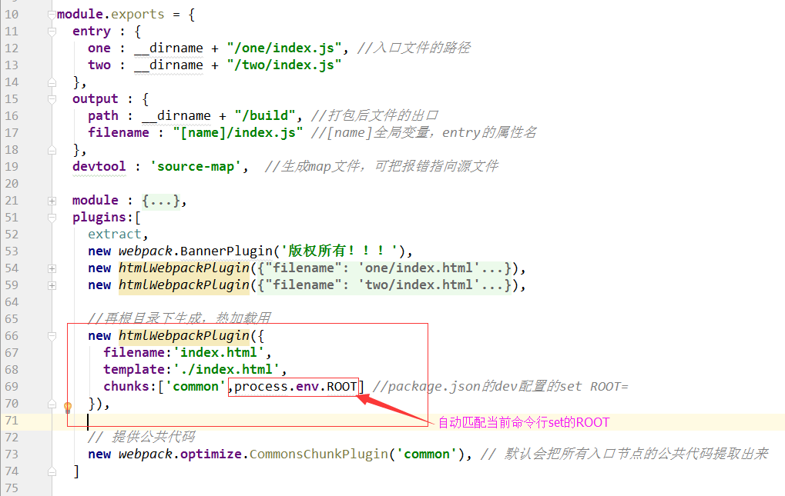
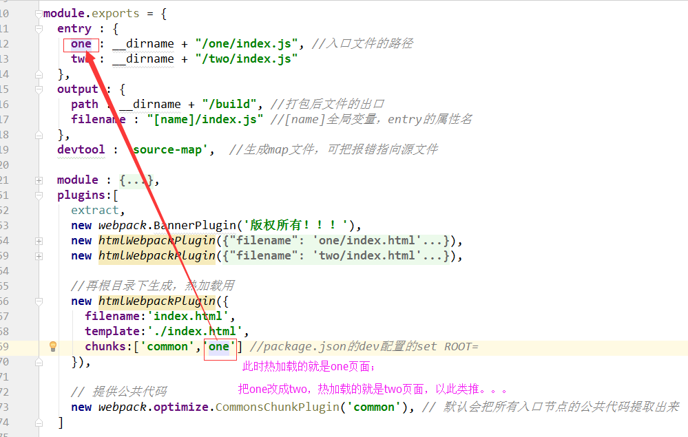

## react+webpack+antd (多入口文件，多html的小demo)
#### 基于webpack3.x （自测已完全可以使用）
- 关于antd的.babelrc或webpack配置请参考 [ant-design官网](https://ant.design/docs/react/introduce-cn)

### 关于开发的热加载（大概两种方法吧）
#### 1.执行set ROOT=one&& npm run dev
  >原理：启动命令时设置ROOT变量，脚本执行时自动匹配对应页面
```
webpack.config.js的plugins配置：
    new htmlWebpackPlugin({
      filename:'index.html',
      template:'./index.html',
      chunks:['common',process.env.ROOT] /*process.env.ROOT自动匹配当前命令行set的ROOT*/
    })

此时在命令行执行：
set ROOT=one&& npm run dev  <!-- 执行这个命令代表当前热加载的是one页面 -->
set ROOT=two&& npm run dev  <!-- 执行这个命令代表当前热加载的是two页面 -->
```

#### 2.执行npm run dev
  >原理：手动配置webpack.config.js
```
    entry : {
        one : __dirname + "/one/index.js", //入口文件的路径
        two : __dirname + "/two/index.js"
    },
  ...

//再根目录下生成，热加载用
    new htmlWebpackPlugin({
      filename:'index.html',
      template:'./index.html',
      chunks:['common','one']  /*此时热加载的是one页面，如果把one改成two则热加载的是two页面(和entry对应)*/
    }),

```



